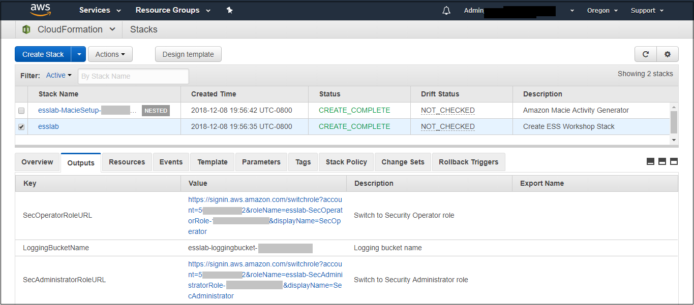
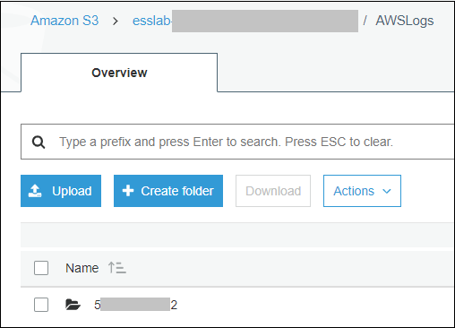
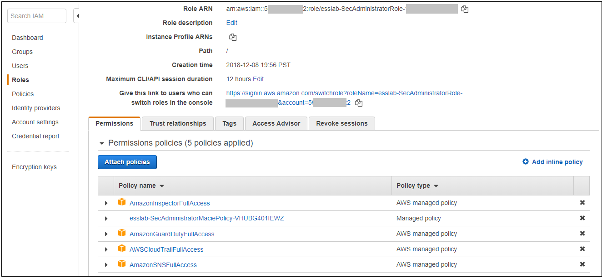
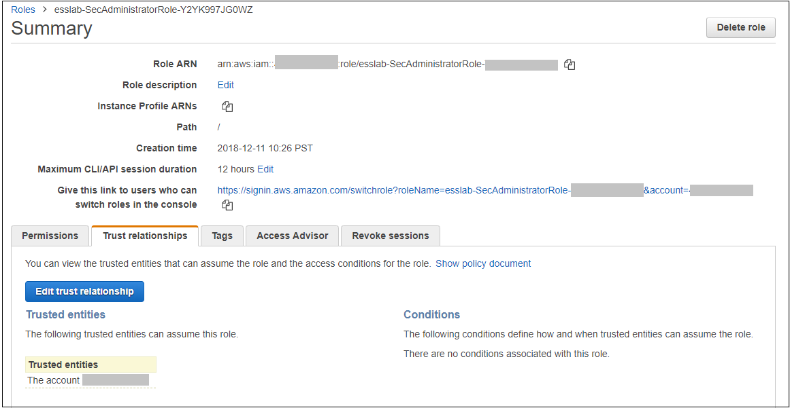
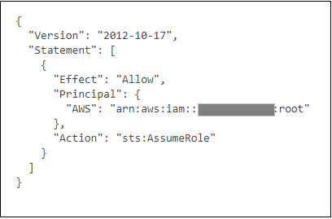
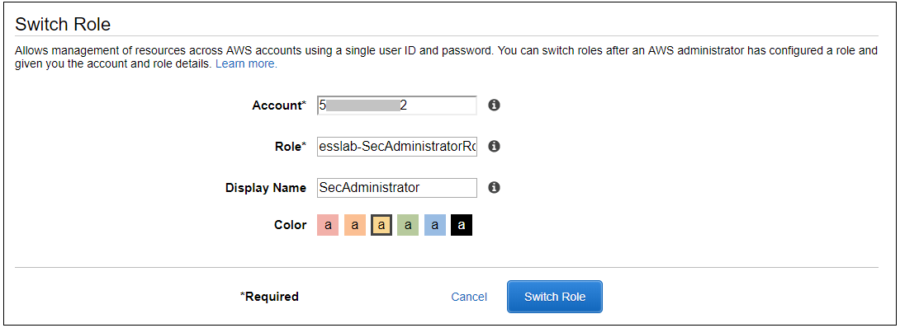
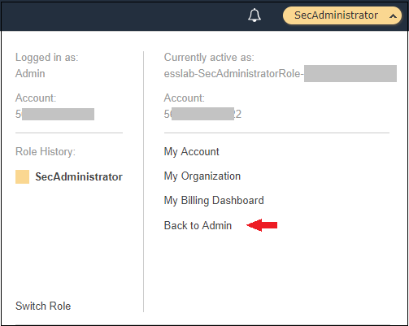
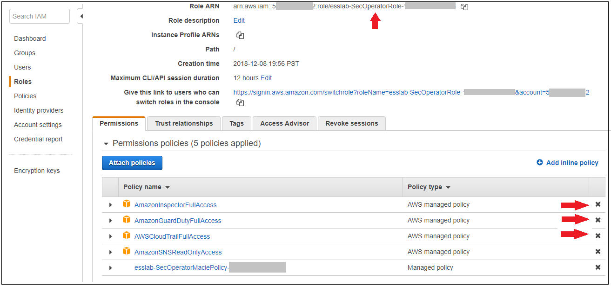

# Access Delegation Round (Build Phase)

| IMPORTANT NOTE!  |
|---|
| Please make sure you have read the **[scenario section](./index.md)** before continuing below. |

## Sign in to AWS

Depending on how you're doing this workshop, expand one of the following dropdowns to sign into AWS.

??? info "AWS-sponsored event"

    1.  In a separate tab in your web browser, go to the URL provided to you and login. 

    2.  After you login click the **AWS Account** box, then click on the Account ID displayed below that (the red box in the image.) You should see a link below that for the **Management console**. Click on that and you will be taken to the AWS console. 

    

??? info "Individual or an event not sponsored by AWS"

    In a separate tab in your web browser, go to https://aws.amazon.com/console and log into your account.

## Enable Macie

1. You will need Macie for this lab so you must make sure Amazon Macie is running.
Select **Macie** from the main console.
Macie will open in a new browser tab.

2. Select the us-west (Oregon) region in the Macie console.

3. When the Macie console appears, if a **Getting Started** button appears, it means that Amazon Macie is disabled.
In that case, click **Getting Started**, confirm that US West (Oregon) is selected as the region, and click **Enable Macie**.
This may take from several seconds to complete.
The Macie console will appear after Macie has been enabled.
Close the browser tab containing the Macie console.

## Enable GuardDuty

1. You will also need GuardDuty for this lab so you will now enable GuardDuty.

2. Return to the AWS Console, sigining into the account again if necessary. Select **GuardDuty** from the main console.  
3. If you see a **Get Started** button, click it.

4. If the region is not set to Oregon, select Oregon for the region.

5. Click **Enable GuardDuty**.

## Build out the environment

> **NOTE*:  The instructions that follow are based on the classic version of the CloudFormation console.  CloudFormation also offers a redesigned console that offers a different overall look and feel.  You are welcome to use the redesigned CLoudFormation console.  If you choose to do so, you will notice some minor differences from the instructions below.

1. Open the **Deploy to AWS** link that follows in a **new browser** tab to deploy the logging environment in the us-west-2 region:  

3. In the new browser tab that you just opened, you will see the Select Template page.  Click **Next**.

4. On the Specify Details/Parameters page, the values have been filled in for you.  Click **Next**.

5. On the Options page, click **Next**.

6. On the Review page, check the **I acknowledge** box and click **Create**.
The acknowledgement is requested because of the creation of resources with custom names.
The CloudFormation template does this when it creates certain resources with names that make it easier to identify them.

    CloudFormation will now begin to create the resources.
**Refresh the browser window to view the progress.**
This takes about five minutes.
Wait until the Status value for the **esslab** stack shows **CREATE_COMPLETE**.
You can refresh the browser window to update the status.

7. Take a look at the outputs for the **esslab** CloudFormation stack.  They will look similar to the picture below.  You may need to drag the horizontal dividing line upwards to see all the output values.

    

    The output value assigned to *LoggingBucketName*  is the name of the bucket into which AWS CloudTrail will deliver its logs.  Copy the value of *LoggingBucketName* to a scratch file on your workstation so you have it available later.

    The value assigned to *SecAdministratorRoleURL* is a URL that you will use later in the lab to temporarily "switch to" (meaning take on the access privileges of) a Securty Administrator role.   This role has full administrative privileges for AWS CloudTrail, Amazon GuardDuty, Amazon Inspector, and Amazon Macie.

    The value assigned to *SecOperatorRoleURL* is a URL that you will use later in the lab to temporarily "switch to" a Securty Operator role.   You will later modify the policy associated with this role so it only has "read only" privileges for AWS CloudTrail, Amazon GuardDuty, Amazon Inspector, and Amazon Macie.

8. Let's take a look at CloudTrail logging.  The most important part of collecting AWS CloudTrail information into an Amazon S3 bucket is setting the correct permissions on the Amazon S3 bucket.

    Go to the S3 console, check the box next to the bucket with the name assigned to *LoggingBucketName* which you note in Step 6, click on **Permissions**, and then Click on **Bucket Policy**.  Note that the policy allows the CloudTrail service to read the ACL of the *LoggingBucket* and also to create logs with prefixes containing the AWS account ID. you can read more about this policy at this [link](https://docs.aws.amazon.com/awscloudtrail/latest/userguide/create-s3-bucket-policy-for-cloudtrail.html).

9. Go to the S3 console, check the box next to the bucket with the name *LoggingBucketName*.  Click on **Properties**. Now click the **Overview** tab and then click the **AWSLogs** folder prefix.
You should then see the AWS account ID of your account as shown below.

    

    This shows that AWS CloudTrail logs for your account have started to make their way to the S3 bucket.
It may take up to five minutes for logs to start appearing.

## Understanding Roles

A role is a security principal, an actor, that has a set of policies and a trust relationship.  A user, an application, or an AWS service can *assume* the role in order to subsititute its own access privileges for those associated with the role.  The *policies* define what AWS actions the role can perform.  The *trust relationshop* defines who is allowed to assume the role.

The CloudFormation stack you just built created two roles. One role is for a Security Administrator who has full access to CloudTrail, GuardDuty, Inspector, and Macie.  The other role is for a Security Operator who, after changes you make later on, will have read-only access to these services.  You are going to switch to the Security Administrator role but before doing so, let's look at the privileges associated with that role so you can see what it does.

1. Go to the IAM console, select **Roles** on the left and search for the string *SecAdministrator*.  You can search either by using your browser's search capability or you can type *SecAdministrator* into the search box.  Click on the role that you retrieve.
The policy definition will be similar to the image below.

    

    There are six managed policies attached to this role, four of them are provided by AWS for GuardDuty, Inspector, CloudTrail, IAM, and SNS.  SNS and IAM are included because it provides for a better console experience.  There is a sixth managed policy that was created for Amazon Macie to illustrate how custom managed poicies can be developed.   Click on each of the managed policies to see the underlying privileges of each.  Note that there are some services, such as Amazon EFS (Elastic File System), that are not granted by any of these policies.  You will confirm this lack of access later in this workshop.

2. From the main page of the role, click the **Trust relationships** tab.  You will see a section on the page telling you that the trusted entity (the entity that can assume the role) is the 12-digit AWS account ID as shown below.  This means that any principal in the account can assume the role.

    

3. The internal representation of the trust relatioship is a JSON policy document.  Click **Show policy document**.  You will see a policy similar to that shown in the picture below.

    

    This policy says that every principal in the account is allowed to use the sts:AssumeRole action to take on the identity of the role.  STS stands for *Security Token Service*.  The AssumeRole API associated with the service creates temporary credentials when you call the API that are associated with the security policies of the role including an access key and a secret access key.  Your application then uses these security tokens to make calls to other AWS APIs with the policies defined in the role.

## Switching to the Security Administrator role

You are now going to learn about how to switch to a new role in the AWS console.
Switching to a new role allows you to temporarily *substitute* your AWS console permissions for those contained in another role.
In this lab, you will be switching to roles that are in your own AWS account.
You can also switch to roles in other AWS accounts to gain access to resources in accounts other than your own.
This is known as *cross-account access*.
You will not be doing *cross-account access* in this lab.

1. Go to the CloudFormation console and view the outputs tab of the CloudFormation stack named *esslab* you just built.

2. Click on the URL next to *SecAdministratorRoleURL*.  You may need to scroll down to see it.
A new browser tab window will appear showing information similar to the image below.

    

    The box contains the account ID (which is the ID of your AWS account), a role name that was created by CloudFormation, and a Display Name.
You can also select a color that will be used to display the role you assume in the console.

    Click **Switch Role**.

    You will now see a new role label named *SecAdministrator* in the top of your console window as shown below.

    

    This means that your *effective* privileges have been *temporarily* replaced with those of the SecAdministrator role.

3.  Go to the Amazon EFS console.  Notice that you get a message telling you that you do not have access to any of the features of the console.  This is because none of the underlying policies grant any access to any part of Amazon EFS.

    

4. Now go to the Amazon Inspector Console.  Click **Assessment Templates** and check the box to the left of the template name that begins with *LampInspectorAssessmentTemplate* and click **Clone**.  A section of the form will appear.  Scroll down towards the bottom and click the **Create** button.   Refresh the screen.  You should now see two templates that begin with *LampInspectorAssessment*.  You have just successfully cloned an assessment template which shows that you have administrative access privileges for Inspector.

5. Now go to the GuardDuty console and select the Settings menu item.  You may see an error message at the top of the screen about **iam:ListPolicyVersions**.  The reason for this is that you do not have full IAM permissions.  Ignore this message.

    To verify that you do have administrative capabilities for GuardDuty, scroll down to the field named *Updated findings* and change the value to **Send notification every 1 hour** and click **Save settings** at the bottom of the window (you may need to scroll down further).
You will see a message at the top of your window (you may need to scroll up) saying that the settings have been saved.  This shows you do have full access to *GuardDuty*.

6.  Go to the Macie console, select the US West (Oregon) region, click Settings, and click on the Content Type icon.
You will see a list of file types appear.
Pick a file type such as *application/cap*, click the edit widget (it looks like a pencil), change the value of the *Enabled* flag to *No - disabled*.
This shows that you have administrative access to Macie.
Close the Macie window.

7.  Go back to the console session that you had for GuardDuty and from there go to the CloudTrail console.

8.  Click **Trails** and then click the trail whose name begins with *esslab*.

9. Toggle the Logging switch to OFF.  You will be asked to confirm.  Click **Continue**.  Now toggle Logging back to ON.
This shows that you have administrative access to CloudTrail.

10.  Now that you have confirmed that you have administrative access to Inspector, Macie, GuardDuty, and CloudTrail, you no longer need your temporary permissions.
Click on the SecAdministrator label and select **Back to** on the bottom right of the menu as shown below.  Also note that the console maintains a role history to make it easier for you to switch back to the SecAdministrator role later.

    

    After you switch back to your regular role the special role label for SecAdministrator is no longer displayed.

## Refine the Security Operator role permissions

Now that you know how to switch to the Security Administrator role, you are going to make some changes to the permissions for the Security Operator role so that it only has read-only access to Macie, GuardDuty, Inspector, and CloudTrail.

1. Go to the IAM console, select **Roles** and search for *SecOperator*.
Click on the resulting role that you see.
The role will have permissions similar to those shown in the picture below.

    

2. Notice that there are once again five managed policies, four AWS-managed policies for Inspector, GuardDuty, CloudTrail, and SNS, and a custom managed policy for Macie.
The managed policies for Inspector, GuardDuty, and CloudTrail still provide full access to the services.  The SNS policy has already been changed to provide read-only access to SNS.
The Macie policy (whose name contains *SecOperatorMaciePolicy*), despite its name, still provides full access to Macie.

3.  Remove the AmazonCloudTrailFullAccess, AmazonGuardDutyFullAccess, and Amazon InspectorFullAccess policies by click on the removal crosses as shown by the arrows.
Add read-only access policies for Inspector, CloudTrail, and GuardDuty.
Also modify the SecOperatorMacie policy so that it provides read-only access to Macie.

    If you need some hints, open the dropdown below.

    

    
<strong>Click here to expand</strong>

     

    Here are some links that offer information that may be helpful to you.  Open them in a *new* browser tab for more information.

    [Controlling access to Amazon CloudTrail](https://docs.aws.amazon.com/awscloudtrail/latest/userguide/control-user-permissions-for-cloudtrail.html)

    [Controlling access to Amazon GuardDuty](https://docs.aws.amazon.com/guardduty/latest/ug/guardduty_managing_access.html)

    [Controlling access to Amazon Inspector](https://docs.aws.amazon.com/IAM/latest/UserGuide/list_amazoninspector.html)

    [Controlling access to Amazon Macie](https://docs.aws.amazon.com/macie/latest/userguide/macie-access-control.html)

    

4. Go to the CloudFormation console and view the outputs tab of the CloudFormation stack named *esslab* you built earlier.

5. Click on the URL next to SecOperatorRoleURL.
A new browser tab window will appear showing information similar to the image below.

    

    The box contains the account ID (which is the ID of your AWS account), a role name that was created by CloudFormation, and a Display Name.
You can also select a color that will be used to display the role you assume in the console.

    Click **Switch Role**.

    You will now see a new role label named *SecAdministrator* in the top of your console window as shown below.

    

    This means that your *effective* privileges have been *temporarily*  replaced with those of the SecOperator role.

6. Now go to the Amazon Inspector Console.  Click **Assessment Templates** and check the box to the left of both of the template name that begins with *LampInspectorAssessmentTemplate* and click **Delete**.  You will be asked to confirm the deletion.  Click **Yes**.  After 30 or so seconds you will see an error message telling you that you are not authorized to call the inspector:DeleteAssessmentTemplate action.  This is because you have read-only access to Inspector.

7. Now go to the GuardDuty console, click **Settings**, change the **Updated findings** field to a different value, and click **Save settings**.  You will see an error message telling you that you are not authorized to perform the UpdateDetector action (the message may appear beneath the first IAM error message).  This is because you have read-only access to GuardDuty.

8.  Go to the Macie console, select the US West (Oregon) region, click on **Settings** and click on the Content Type icon.
You will see a list of file types appear.
Pick a file type such as *application/cap*, edit it and change the value of the *Enabled* flag and click **Save**.
You will receive an error message because you have read-only access to Macie.
Close the Macie window.

8.  Go back to the console session that you had for GuardDuty and from there go to the CloudTrail console.

9.  Click **Trails** and click the trail whose name begins with *esslab*.

10. Toggle the Logging switch to OFF.  Click **Continue**.  You will receive an error message because you have read-only access to CloudTrail.

11. Now switch back to your default role.
After you to this the SecOperator role label will no longer appear on your console.

12. If you doing this workshop as part of a team, you will pass your account credentials to another team that will verify the configuration of your roles.
Click [here](./verify.md) to proceed to the Verify Phase.
