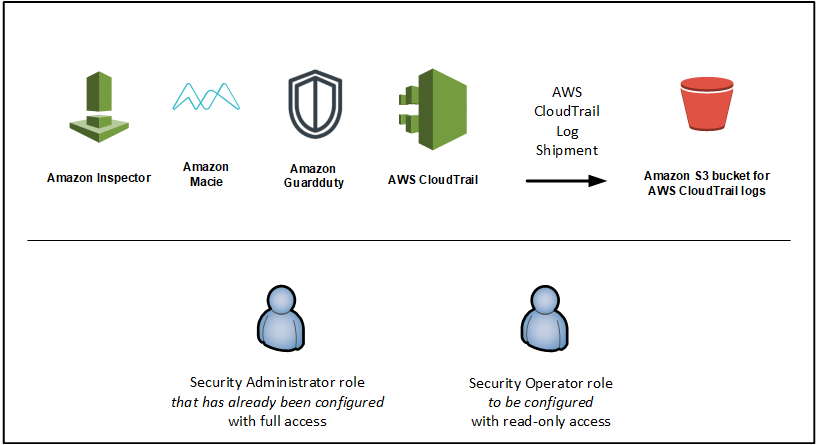

# Access Delegation Round

Welcome to the world of Access Delegation!

In this round, you are going to work through a scenario that could arise in an organization that uses Amazon Web Services for production workloads.
You will play the role of an AWS "superuser" administrator.
You have heard that Amazon GuardDuty, Inspector, and Macie are services that can help you monitor the data, host, and network traffic within your AWS environment and detect anomalous behaviors.
In this round of the workshop, you will learn how to use Amazon IAM to delegate access to these services to AWS Security Administrators and AWS Security Operators.
AWS Security Administrators require full access to AWS security services while AWS Security Operators only require "read only" access to the services.  You will use AWS IAM roles to do this and thereby promote the Principle of Least Privilege - giving users the minimum level of privilege they need to do their tasks.

**AWS Service/Feature Coverage**: 

* AWS Identity and Access Management (IAM)
* Console role-switching
* Amazon GuardDuty
* Amazon Inspector
* Amazon Macie

## Agenda

This round is broken down into Build and Verify Phases.

* **BUILD** (45 min): At a high level, in the Build Phase you will do the following:

1. Build the environment using AWS CloudFormation in the us-west-2 (Oregon) region.
2. Perform further customization on the environments to restrict the capabilities of the Security Operator Role.
3. Test your customizations.
4. Pass your credentials to another team to verify the configuration of your environment.

* **VERIFY** (30 min):  The Verify Phase involves testing the work that *another team* did in building the environmentensure the requirements were met. You will do the following:

1. Obtain the login credentials from another team that has performed the steps in the Build Phase.
2. Test the environment to determine if the Security Operator role has been properly configured.
2. Document any variances.

> This workshop can be done as a team exercise or individually. The instructions are written with the assumption that you are working as part of a team but you could just as easily do the steps below individually. If done as part of an AWS sponsored event then you'll be split into teams of around 4-6 people. Each team will do the Build Phase and then hand off their accounts to another team. Then another team will do the Verify Phase.

## Assumptions and Prerequisites

1. You will need an AWS account for this lab and administrative credentials.
These may be provided by an event sponsor.
2. You should be familiar with AWS core services such as AWS CloudFormation and Amazon S3.  You should also be comfortable using the AWS console.
3. The instructions are written with the understanding that the account is new or clean.  We strongly recommend that you do not do these labs in work or "production" accounts.

## Architecture Overview

The environment in this round consists of an AWS account in which Amazon GuardDuty, Amazon Inspector, Amazon Macie and Amazon CloudTrail will run.  The CloudTrail logs will be sent to an Amazon S3 bucket.  An Amazon EC2 instance will be launched which will in turn start the [Amazon Macie Activity Generator](https://github.com/aws-samples/amazon-macie-activity-generator) and also launch an Amazon Inspector assessment.

The template also creates two AWS IAM roles.  The first role is for a Security Administrator which has full access to the External Security Services.  The second role is for Security Operators.  The Security Operator role *initially* is very similar to the Security Administrator role but you will modify the permissions of the Security Operator role to provide "read only" access to the External Security Services.  The use of Security Administrator/Operator roles is very common in organizations that want to delegate the use of security services to different security teams.

Here is a picture of what you will build.

## Preparation

1. You will need an AWS account and the associated administrative login credentials.
These may be provided by an event sponsor.

## [Click here to proceed to the Build Phase](./build.md)

