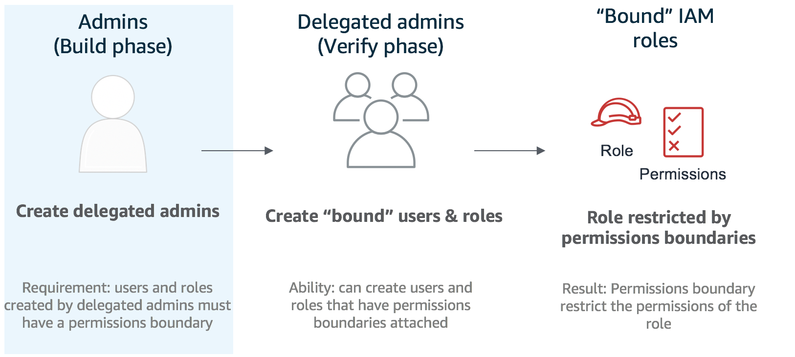
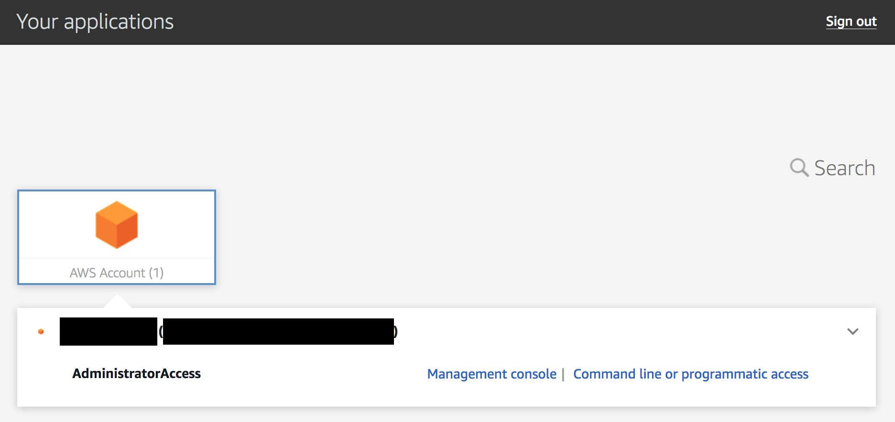

# Permissions boundaries workshop - <small> Advanced edition </small>
# <small> Build phase </small>

The three elements of a permissions boundary are represented below. When your team does the **BUILD** tasks you will act as the admins. When your team does the **VERIFY** tasks you will act as the delegated admins (webadmins). The delegated admins (webadmins) will create roles that can be considered **"bound"** since they will have a permissions boundary attached.  



## Setup Instructions

To setup your environment please expand one of the following drop-downs (depending on how if you are doing this workshop at either an **AWS event** or **individually**) and follow the instructions:

??? info "Click here if doing this workshop at an *AWS Event and AWS has provided the account to use*"

	**Console Login:** if you are attending this workshop at an official AWS event then your team should have the URL and login credentials for your account. This will allow you to login to the account using AWS SSO. Browse to that URL and login. 

	After you login click **AWS Account** box, then click on the Account ID displayed below that (the red box in the image.) You should see a link below that for **Management console**. Click on that and you will be taken the AWS console. 

	

	Make sure the region is set to US East 2 (Ohio)

	**CloudFormation:** Launch the CloudFormation stack below to setup the environment:

	Region| Deploy
	------|-----
	US East 2 (Ohio) | <a href="https://console.aws.amazon.com/cloudformation/home?region=us-east-2#/stacks/new?stackName=Perm-Bound-Adv&templateURL=https://s3-us-west-2.amazonaws.com/sa-security-specialist-workshops-us-west-2/identity-workshop/permissionboundary/identity-workshop-web-admins-advanced.yaml" target="_blank"></a>

	1. Click the **Deploy to AWS** button above.  This will automatically take you to the console to run the template.  
	2. Click **Next** on the **Select Template** section.
	3. Click **Next** on the **Specify Details** section (the stack name will be already filled - you can change it or leave it as is)
	4. Click **Next** on the **Options** section.
	5. Finally, acknowledge that the template will create IAM roles under **Capabilities** and click **Create**.

	This will bring you back to the CloudFormation console. You can refresh the page to see the stack starting to create. Before moving on, make sure the stack shows **CREATE_COMPLETE**.

	* Go back to the SSO login page (the first tab you opened should still have that page) and click **Command line or programmatic access**. Copy the temporary credentials using whichever option fits your setup best. 

	

	* Paste the credentials into the [credentials file](https://docs.aws.amazon.com/cli/latest/userguide/cli-configure-files.html) (~/.aws/credentials if running on a Mac or Linux)

??? info "Click here if doing this workshop *using your own account at an AWS event or online on your own*"

	Log in to your account however you would normally.

	**CloudFormation:** Launch the CloudFormation stack below to setup the environment:

	Region| Deploy
	------|-----
	US East 2 (Ohio) | <a href="https://console.aws.amazon.com/cloudformation/home?region=us-east-2#/stacks/new?stackName=Perm-Bound-Adv&templateURL=https://s3-us-west-2.amazonaws.com/sa-security-specialist-workshops-us-west-2/identity-workshop/permissionboundary/identity-workshop-web-admins-advanced.yaml" target="_blank"></a>

	1. Click the **Deploy to AWS** button above.  This will automatically take you to the console to run the template.  
	2. Click **Next** on the **Select Template** section.
	3. Click **Next** on the **Specify Details** section (the stack name will already be filled - you can change it or leave it as is)
	4. Click **Next** on the **Options** section.
	5. Finally, acknowledge that the template will create IAM roles under **Capabilities** and click **Create**.

	This will bring you back to the CloudFormation console. You can refresh the page to see the stack starting to create. Before moving on, make sure the stack is in a **CREATE_COMPLETE**.


!!! Attention
	Throughout the workshop, keep in mind where you need to add the Account ID, correctly use pathing and change the region specified if needed (although if you are taking this as part of an AWS event, just use the already specified us-east-2.) Missing any of these items can result in problems and errors like **"An error occurred (MalformedPolicyDocument) when calling the CreatePolicy operation: The policy failed legacy parsing"**.

## Task 1 <small>Create the webadmins role</small>

* Create an IAM role that will be used by the webadmins (Initially this role will trust your own AWS account but in the **Verify** phase you will configure it to trust the other team's account.) 
* Use the following JSON to create a file name trustpolicy1 for the trust (assume role) policy: 
	`{ "Version": "2012-10-17", "Statement": { "Effect": "Allow", "Principal": { "AWS": "arn:aws:iam::Account_ID:root"}, "Action": "sts:AssumeRole" } }`
* Create the webadmin role:
`aws iam create-role --role-name webadmins --assume-role-policy-document file://trustpolicy1`
* Add the Lambda Read Only policy to the role
`aws iam attach-role-policy --policy-arn arn:aws:iam::aws:policy/AWSLambdaReadOnlyAccess  --role-name webadmins`


## Task 2 <small>Create the permissions boundary for the webadmins</small>

We will use permissions boundaries to set the maximum permissions of the roles created by the webadmins. The permissions boundary should only allow the following actions: Create log groups, create log streams and put logs, list the files in the webadmins folder of the bucket that starts with `"shared-logging-"` and ends in `"-data"`

* Use the following JSON to create a file named boundarydoc for the policy document:
	
``` json
{
    "Version": "2012-10-17",
    "Statement": [
        {
            "Sid": "CreateLogGroup",
            "Effect": "Allow",
            "Action": "logs:CreateLogGroup",
            "Resource": "arn:aws:logs:us-east-2:ACCOUNT_ID:*"
        },
        {
            "Sid": "CreateLogStreamandEvents",
            "Effect": "Allow",
            "Action": [
                "logs:CreateLogStream",
                "logs:PutLogEvents"
            ],
            "Resource": "arn:aws:logs:us-east-2:ACCOUNT_ID:log-group:/aws/lambda/*:*"
        },
        {
            "Sid": "AllowedS3GetObject",
            "Effect": "Allow",
            "Action": [
                "s3:List*"
            ],
            "Resource": "arn:aws:s3:::shared-logging-ACCOUNT_ID-us-east-2-data",
             "Condition": {
                "StringEquals": {
                    "s3:prefix": "webadmins"
             		}
        		}
        }		
    ]
}
```
* Create the policy:
	* `aws iam create-policy --policy-name webadminspermissionsboundary --policy-document file://boundarydoc`

!!! question
	* What will the webadmins attach the permissions boundary to?
	* How does a permissions boundary differ from a standard IAM policy?
	* How could you test the permissions boundary at this point?

## Task 3 <small>Create the permission policy for the webadmins</small>

!!! hint 
	The question marks **`????`** in the resource elements below should be replaced with something that could act as a resource restriction.  The end result is that you will have a pathing requirement for the roles and policies.
	
* Use the following JSON to create a file named policydoc for the policy document:

``` json
{
    "Version": "2012-10-17",
    "Statement": [
		{
            "Sid": "CreateCustomerManagedPolicies",
            "Effect": "Allow",
            "Action": [
                "iam:CreatePolicy",
                "iam:DeletePolicy",
                "iam:CreatePolicyVersion",
                "iam:DeletePolicyVersion",
                "iam:SetDefaultPolicyVersion"
            ],
            "Resource": "arn:aws:iam::ACCOUNT_ID:policy/webadmins/????"
        },
        {
        	  "Sid": "RoleandPolicyActionswithnoPermissionBoundarySupport",
            "Effect": "Allow",
            "Action": [
            		"iam:UpdateRole",
                	"iam:DeleteRole"
            ],
            "Resource": [
                "arn:aws:iam::ACCOUNT_ID:role/webadmins/????"
            ]
        },
        {
            "Sid": "CreateRoles",
            "Effect": "Allow",
            "Action": [
                "iam:CreateRole",
                "iam:AttachRolePolicy",
                "iam:DetachRolePolicy"
            ],
            "Resource": [
                "arn:aws:iam::ACCOUNT_ID:role/webadmins/????"
            ],
            "Condition": {"StringEquals": 
                {"iam:PermissionsBoundary": "arn:aws:iam::ACCOUNT_ID:policy/webadminspermissionsboundary"}
            }
        },
        {
            "Sid": "LambdaFullAccess",
            "Effect": "Allow",
            "Action": "lambda:*",
            "Resource": "arn:aws:lambda:us-east-2:ACCOUNT_ID:function:*"
        },
        {
            "Sid": "PassRoletoLambda",
            "Effect": "Allow",
            "Action": "iam:PassRole",
            "Resource": "arn:aws:iam::ACCOUNT_ID:role/webadmins/????",
            "Condition": {
                "StringLikeIfExists": {
                    "iam:PassedToService": "lambda.amazonaws.com"
                }
            }
        },
        {
            "Sid": "AdditionalPermissionsforLambda",
            "Effect": "Allow",
            "Action": 	["kms:ListAliases", "logs:Describe*", "logs:ListTagsLogGroup", "logs:FilterLogEvents", "logs:GetLogEvents"],
            "Resource": "*"
        },
        {
            "Sid": "DenyPermissionBoundaryandPolicyDeleteModify",
            "Effect": "Deny",
            "Action": [
                "iam:CreatePolicyVersion",
                "iam:DeletePolicy",
                "iam:DeletePolicyVersion",
                "iam:SetDefaultPolicyVersion"
            ],
            "Resource": [
                "arn:aws:iam::ACCOUNT_ID:policy/webadminspermissionsboundary",
                "arn:aws:iam::ACCOUNT_ID:policy/webadminspermissionpolicy"
            ]
        },
        {
            "Sid": "DenyRolePermissionBoundaryDelete",
            "Effect": "Deny",
            "Action": "iam:DeleteRolePermissionsBoundary",
            "Resource": "*"
        }
    ]
}
```
 
* Create the policy named `webadminspermissionpolicy`:
	* `aws iam create-policy --policy-name webadminspermissionpolicy --policy-document file://policydoc`
* Attach the policy to the webadmins role
	* `aws iam attach-role-policy --role-name webadmins --policy-arn arn:aws:iam::Account_ID:policy/webadminspermissionpolicy`
* When you are done the **webadmins** role should have these two policies attached: webadminspermissionpolicy & AWSLambdaReadOnlyAccess.

!!! question

	* Why were there some blocks above that used the permissions boundary condition and some that did not?
	* Why are we using pathing here?
	* There are two ways of doing resource restrictions: naming and pathing. Which option allows you to create policies using both the AWS Console and CLI?
	* Why do we add the Deny for DeletePolicy actions regarding the webadminspermissionsboundary & webadminspermissionpolicy?
	
## Task 4 <small>Test the webadmins permissions</small>
	
#### You should now check that using **webadmins** role you can create a policy, a role (attaching both a permission policy and permissions boundary to the role) and finally create a Lambda function into which you will pass that role. 

* Add the following to the AWS CLI [config file](https://docs.aws.amazon.com/cli/latest/userguide/cli-configure-role.html) (~/.aws/config if running on a Mac or Linux) so you can easily assume the webadmins role from the CLI.

```
[profile webadmins]
role_arn = arn:aws:iam::Account_ID:role/webadmins
source_profile = Name_of_the_Credential_Profile
```

Now do the following using the webadmins role:

* Create a policy that allows for s3:* and logs:*
* Create a role (this role should use Lambda as the trusted entity and attach the policy you just created to it)
* Create a Lambda function, pass the role to it and make sure you can run the function. 


## Task 5 <small>Gather info needed for the **VERIFY** phase</small>

#### Now that you have setup access for the webadmins, it's time to pass this information on to the next team who will work through the **VERIFY** tasks. If you are doing this workshop online on your own then you can just run through the **VERIFY** phase yourself (skip this task).

### Walk Through

* Get the Account ID from the other team so you can add that to the trust policy on the webadmin role
* Use the following JSON to create a file name trustpolicy2 for the trust (assume role) policy (replace `ACCOUNT_ID` with your account ID so you can still test this and the `ACCOUNT_ID_OTHER_TEAM` with the other team's account ID:) 
	* `{"Version":"2012-10-17","Statement":[{"Effect":"Allow","Principal":{"AWS":["arn:aws:iam::YOUR_ACCOUNT_ID:root","arn:aws:iam::OTHER_TEAM_ACCOUNT_ID_:root"]},"Action":"sts:AssumeRole"}]}`

* Update the trust policy on the webadmins roles so both your team  and the verify team can assume the role
	* `aws iam update-assume-role-policy --role-name webadmins --policy-document file://trustpolicy2`

 If you were given a form to fill out then enter the info into the form and hand it to another group (or send this to the other group using whatever method is easiest.) Information to pass (recommended names for certain objects provided below - only change if you didn't go with the recommended names):
 
* Webadmins role ARN:	arn:aws:iam::`YOUR_ACCOUNT_ID`:role/**webadmins**
* Resource restriction for both the roles and policies: /webadmins/`Resource restriction you used`
* Permissions boundary name: **webadminspermissionsboundary**
* Permission policy name: **webadminspermissionpolicy**

### <small>[Click here to go to the VERIFY phase](./verify.md)</small>