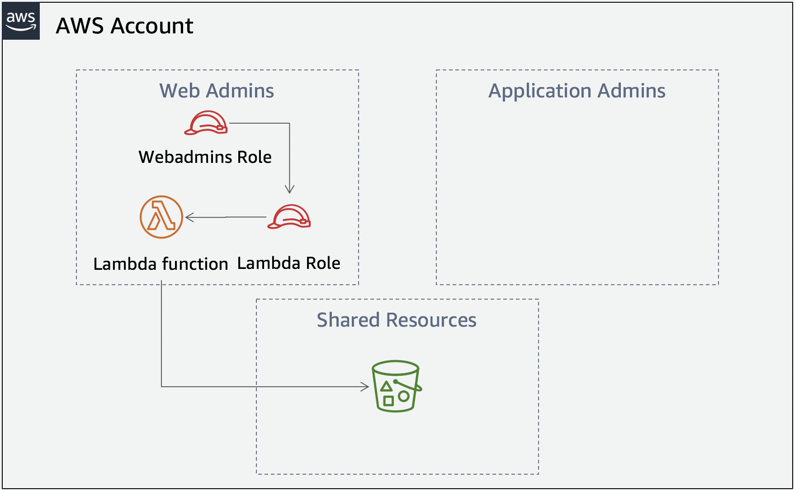

# Permission boundaries workshop - Advanced -  <small> VERIFY phase</small>

It's now time **VERIFY** the setup the admins did by putting on the webadmins hat. As the webadmins you will check that you can do the following: 

1. Create an IAM policy
2. Create an IAM role (and attach that policy) 
3. Create a Lambda function (and attach that role)

If doing this as part of an AWS event you should have received the following information from another team. You will need the **Account ID** and the **Resource restriction** information to complete the tasks in this phase.

```
Webadmins role ARN:	arn:aws:iam::`ACCOUNT_ID_FROM_OTHER_TEAM`:role/**webadmins**
Resource restriction for both the roles and policies: /webadmins/`Resource restriction`
Permissions boundary name: **webadminspermissionsboundary**
Permission policy name: **webadminspermissionpolicy**
```

* To carry out these tasks as the webadmins, you will need to assume that role. To make that process easier, add the following to the `~/.aws/config` file:

```
[profile webadmins]
role_arn = arn:aws:iam::ACCOUNT_ID_FROM_OTHER_TEAM:role/webadmins
source_profile = default
```

**When you want to reference a profile other then the default one you need to add the `--profile` parameter to the CLI command. Since we are naming this profile webadmins, you will need to specify `--profile webadmins` for the commands in this phase.**

??? info "Application architecture"
	
	
	
	
	****

---

!!! Attention
	### As in the Build phase, keep in mind where you need to add the Account ID, correctly use pathing and change the region specified if needed (although if you are taking this as part of an AWS event, just use the already specified us-east-2.) Also you will need to use the --profile parameter for all of the commands in the following tasks.

## Task 1 <small>Create a policy</small>
	
#### First you will create a permission policy which just needs to allow log file creation and s3:ListBucket. You are in a hurry though, like many developers, and give the role full S3 permissions. The policy you create here will later be attached to the role you create in Task 2 which will then be passed to a Lambda function you will create in **Task 3**.

* Use the following JSON to create a file named verifypolicydoc: 
	* `{"Version":"2012-10-17","Statement":[{"Effect":"Allow","Action":["logs:CreateLogGroup","logs:CreateLogStream","logs:PutLogEvents","s3:*"],"Resource":"*"}]}`
* Create the policy (**there is a key parameter missing from the command below. Check the [AWS CLI documentation.](https://docs.aws.amazon.com/cli/latest/reference/)**)
	* `aws iam create-policy --policy-name NAME_OF_POLICY --policy-document file://verifypolicydoc`
<!-- `aws iam create-policy --policy-name NAME_OF_POLICY --path /webadmins/ --policy-document file://verifypolicydoc` -->

## Task 2 <small>Create a role</small>

#### The role you create here will be passed to the Lambda function you create in the next task.

* Use the following JSON to create a file named verifytrustpolicy (replace the Account ID): 
	* `{ "Version": "2012-10-17", "Statement": { "Effect": "Allow", "Principal": { "Service": "lambda.amazonaws.com"}, "Action": "sts:AssumeRole" } }`
* Create the role (**there is a key parameter missing from the command below. Check the [AWS CLI documentation](https://docs.aws.amazon.com/cli/latest/reference/)**)
	* `aws iam create-role --role-name NAME_OF_ROLE --path /webadmins/ --assume-role-policy-document file://verifytrustpolicy`
<!-- `aws iam create-role --role-name NAME_OF_ROLE --path /NAME_OF_PATH/ --assume-role-policy-document file://verifytrustpolicy --permissions-boundary arn:aws:iam::Account_ID:policy/webadminspermissionsboundary` -->
* Attach the policy you created in **Task 1** to the role:
	* `aws iam attach-role-policy --policy-arn arn:aws:iam::Account_ID:policy/NAME_OF_PATH/NAME_OF_POLICY --role-name NAME_OF_ROLE`
		
## Task 3 <small>Create and test a Lambda function</small>

#### Finally you will create a **Node.js 8.10** Lambda function using the sample code below and pass the IAM role you just created
 
* Create a file named **`index.js`** using the code below and then zip the file (`zip lambdafunction.zip index.js`). Replace `"SHARED_LOGGING_BUCKET_NAME"` with the name of bucket that begins with `"shared-logging-"` and ends in `"-data"`. In order to get the bucket name, just run `aws s3 ls` using the webadmins role.)

``` node
const AWS = require('aws-sdk');
const s3 = new AWS.S3();

exports.handler = async (event) => {
  console.log('Loading function');
  const allKeys = [];
  await getKeys({ Bucket: 'SHARED_LOGGING_BUCKET_NAME' , Prefix: 'webadmins'}, allKeys);
  return allKeys;
};

async function getKeys(params, keys){
  const response = await s3.listObjectsV2(params).promise();
  response.Contents.forEach(obj => keys.push(obj.Key));

  if (response.IsTruncated) {
    const newParams = Object.assign({}, params);
    newParams.ContinuationToken = response.NextContinuationToken;
    await getKeys(newParams, keys); 
  }
}
```
* Create a Lambda function
	* `aws lambda create-function --function-name verifyfunction --runtime nodejs8.10 --role arn:aws:iam::Account_ID:role/webadmins/NAME_OF_ROLE --handler index.handler --region us-east-2 --zip-file fileb://lambdafunction.zip`
* Invoke the Lambda function and make sure it is generating logs in CloudWatch logs and that it is able to list the objects in the bucket.
	* `aws lambda invoke --function-name verifyfunction --region us-east-2 --invocation-type RequestResponse outputfile.txt`
* Examine the output file. It should show a number of log files in the S3 bucket that the Lambda function read. 

If you see files marked that **webadmins/you-should-SEE-this-file--webadmins...** then you have successfully verified that the webadmins can do their job. Congratulations!

## Task 3 <small>Cleanup</small>

To cleanup you need to delete the CloudFormation stack named `Perm-Bound-Adv`. This will also remove the Cloud9 environment:

* Navigate to the <a href="https://us-east-2.console.aws.amazon.com/cloudformation/home?region=us-east-2#/stacks?filter=active" target="_blank">AWS CloudFormation</a> console.
* Click the box next to the `Perm-Bound-Adv` stack.
* Click the **Actions** pull down menu and then click **Delete Stack**.