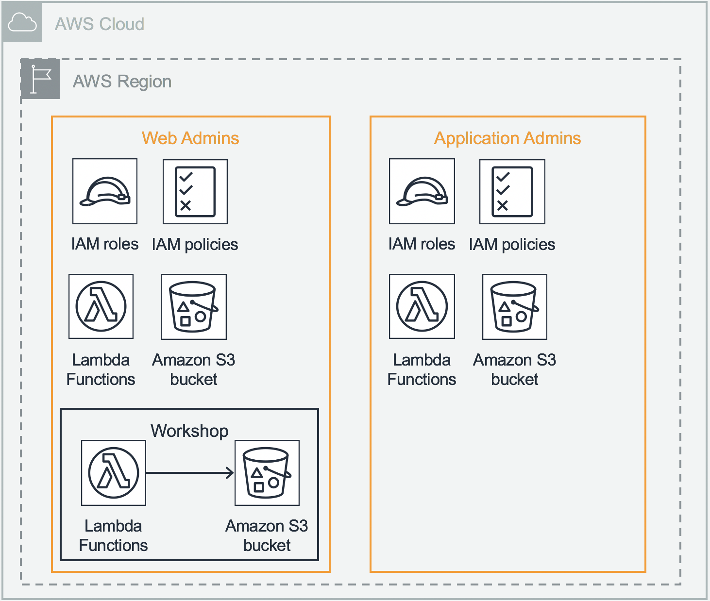

# Permission boundaries round <small>VERIFY phase</small>

You are now in the **VERIFY** phase. It is time to put on the hat of the web admins and test out their access. First you verify that you are able to do what you should be allowed to do. With any remaining time, check if there are other resources in the account that you can access. 

You should have receieved from another team the following information:

* IAM users sign-in link:	**https://Account_ID.signin.aws.amazon.com/console**
* IAM user name:	**webadmin**
* IAM user password:	
* Resource restriction identifier:	
* Permission boundary name: **webadminpermissionboundary**
* Permission policy name: **webadminpermissionpolicy**

The web admins (you) should only have access to the following resources:

1. IAM policies and roles created by the web admins
2. Lambda functions created by the web admins

The web admins should not be able to impact any resources in the account that they do not own including IAM users, roles, S3 buckets, Lambda functions, etc.

You will be setting up an IAM policy, an IAM role and a Lambda function. The Lambda function should be able to list files in an S3 bucket. This is how you will verify you are able to do what the web admins are allowed to do.

Application architecture: 

## Task 1 <small>Create a customer managed IAM policy</small>
	
* The first step is to create a customer managed IAM policy. This will set the permissions of the role that you will pass to a Lambda function. Since the function will be working with S3 and since the point of this is to show how permission boundaries work, use the following policy which grants basic Lambda logging permissions and S3 full access. 
* Keep in mind the resource restrictions put in place which will require you to use a certain name for the policy.

``` json
{
    "Version": "2012-10-17",
    "Statement": [
        {
            "Effect": "Allow",
            "Action": [
                "logs:CreateLogGroup",
                "logs:CreateLogStream",
                "logs:PutLogEvents",
                "s3:*"
            ],
            "Resource": "*"
        }
    ]
}
```

## Task 2 <small>Create an IAM role</small>

* Next you will create an IAM Role. Choose Lambda as the service for this role. Attach the policy you just created and the permission boundary (which will most likely be named:  **webadminpermissionboundary**)
* Keep in mind the resource restrictions put in place which will require you to use a certain name for the role.
	
## Task 3 <small>Create a Lambda function</small>

* Finally you will create a **Node.js 8.10** Lambda function using the code below and attach the IAM role you just created to it. You will need to replace `"WEB_ADMIN_BUCKET_NAME"` with the bucket from the account that begins with `"web-admins-"` and ends in `"-data"`

``` node
const AWS = require('aws-sdk');
const s3 = new AWS.S3();

exports.handler = async (event) => {
  console.log('Loading function');
  const allKeys = [];
  await getKeys({ Bucket: 'WEB_ADMIN_BUCKET_NAME' }, allKeys);
  return allKeys;
};

async function getKeys(params, keys){
  const response = await s3.listObjectsV2(params).promise();
  response.Contents.forEach(obj => keys.push(obj.Key));

  if (response.IsTruncated) {
    const newParams = Object.assign({}, params);
    newParams.ContinuationToken = response.NextContinuationToken;
    await getKeys(newParams, keys); 
  }
}
```

* Test the Lambda function and make sure it is generating logs in CloudWatch logs and that it is able to list the objects in the bucket. In order to test you will need to create a test event. The parameters of the test do not matter.

## Task 4 <small>Investigate if you are able to do anything else</small>

The final step is to determine if you can do anything else in the account. Can you impact any resources not owned by the web admins?