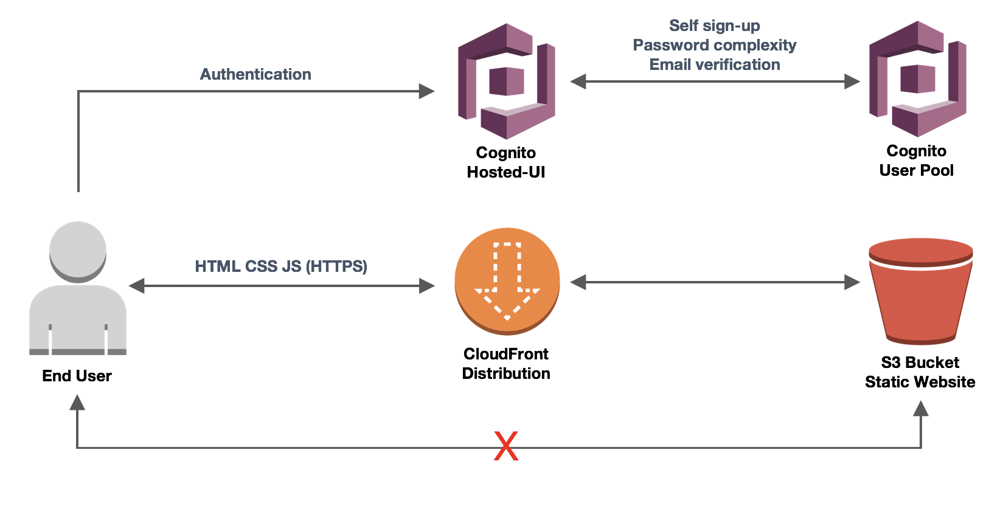

# Serverless Round <small>Verify Phase</small>

Now that the additional identity controls have been added to the application, you have been tasked with acting as an end user and manually testing to verify that the controls have been put in place correctly and that the requirements have been met.

## Login Instructions

The Build team created a cross-account AWS IAM Role to allow you complete your testing and verification tasks.  To complete your tasks switch roles in the AWS Management Console to this role.

1. Open the <a href="https://console.aws.amazon.com/cloudformation/home?region=us-east-1#/stacks?filter=active" target="_blank">Amazon CloudFormation</a> console (us-east-1)
2. Click on the **Identity-RR-Wksp-Serverless-Round** stack.
3. Click on **Outputs** and copy down **VerifyAWSAccount**.
4. Click your account drop down in the top right corner of the Management Console next to the bell (third from the right).
5. Click on **Switch Roles**
6. Enter the following information
	* **Account**: VerifyAWSAccount #
	* **Role**: identity-wksp-serverless-verify
	* **Display Name**: Build
	* **Color**: your choice
	
	
Now that you are logged into the Build AWS account you can access find their application URLs in the CloudFormation stack Outputs.

1. Open the <a href="https://console.aws.amazon.com/cloudformation/home?region=us-east-1#/stacks?filter=active" target="_blank">Amazon CloudFormation</a> console (us-east-1)
2. Click on the **Identity-RR-Wksp-Serverless-Round** stack.
3. Click on **Outputs** and use **WebsiteCloudFrontURL** and **WebsiteS3URL**.


## Verify Task 1

*Ensure the application serves content out through the CloudFront Distribution and that your end users can only access the application through CloudFront URLs and not Amazon S3 URLs. As part of this configuration your end users should not be able to affect the availability or integrity of the application.*

!!! tip "Verification Checklist"

    * You can access the site through the CloudFront Distribution URL (<WebsiteCloudFrontURL\>).

    * You are restricted from accessing any of the application resources through S3 URLs (<WebsiteS3URL\>).

	    > Try some deep links (e.g. <WebsiteS3URL\>/js/vendor/unicorn-icon)

    * You can not delete or modify any of the application resources through the CloudFront Distribution.

	    > Try using something like curl or Postman to make requests with different HTTP verbs (e.g. Delete).  Below is an example using curl:  

        ```
        curl -i -X DELETE <WebsiteCloudFrontURL>/index.html
        ```

## Verify Task 2

*Set up user management for the application using Cognito User pools.  To reduce the operational overhead of creating and maintaining forms and custom logic for authentication, the decision has been made to use the Cognito hosted-UI to integrate the application with the User Pool.*

*As part of the user experience users should be able to sign themselves up, they should have to validate their email address, and be required to create a password that meets the password complexity requirements for applications set in your security standards.*

!!! tip "Verification Checklist"

    * You are taken to the hosted UI when clicking on **Giddy Up**.

    * You are able to sign your self up for the site.

    * You are required to create a password with the following complexity:
	    * *Minimum length of 10 characters*
	    * *Must include symbols*
	    * *Must include numbers*
	    * *Must include uppercase characters*
	
    * You are required to verify your email address.

    * After authentication, you are redirected to ride.html and are presented with your JWT IdToken.


## Final Architecture



!!! warning "Please complete the post-workshop knowledge check."
    #### **<a href="https://amazonmr.au1.qualtrics.com/jfe/form/SV_cMukUtteV5cmo73" target="_blank">Knowledge Check</a>**

## Cleanup

In order to prevent charges to your account we recommend cleaning up the infrastructure that was created, especially if you are doing other Identity rounds. Expand one of the following dropdown sections and follow the instructions:

??? info "AWS Sponsored Event"

    No cleanup required! The responsibility falls to AWS.

??? info "Individual"

    You will need to manually delete some resources before you delete the CloudFormation stacks so please do the following steps in order.

    1.	Delete the Amazon Cognito Domain for the hosted-UI.
	    * Go to the <a href="https://console.aws.amazon.com/cognito/users/?region=us-east-1" target="_blank">Amazon Cognito</a> console.
        * Click on the **WildRydes** pool.
	    * On the left navigation under **App Integration**, click on **Domain Name**.
	    * Click **Delete**
	    * Click the acknowledgement checkbox and click **Delete**

    2.	Delete the CloudFormation stack (**Identity-RR-Wksp-Serverless-Round**).
	    * Go to the <a href="https://console.aws.amazon.com/cloudformation/home?region=us-east-1#/stacks?filter=active" target="_blank">AWS CloudFormation</a> console.
	    * Select the appropriate stack.
	    * Select **Action**.
	    * Click **Delete Stack**.

***

Congratulations on completing the Serverless Round!


